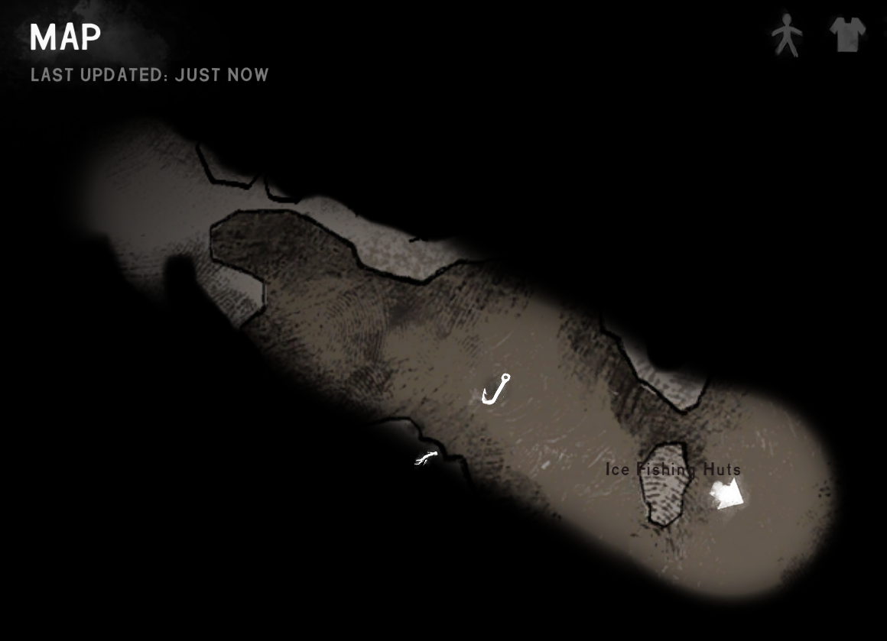
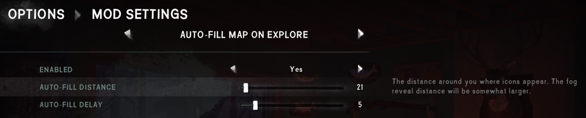

**Auto-Fill Map on Explore** is a [The Long Dark] survival mode mod that fills in the map around
you as you explore, with a configurable range.

> 

## Contents
* [Install](#install)
* [Use](#use)
* [Configure](#configure)
* [Compatibility](#compatibility)
* [Security](#security)
* [See also](#see-also)

## Install
1. Install [MelonLoader] and [ModSettings][TLDMods].
2. [Download this mod][mod page] directly into your game's `Mods` subfolder.
3. Launch the game.

## Use
Just explore normally! The area around you will get mapped as you walk.

The default options are tuned to balance organic exploration with the game's [charcoal
surveying][charcoal]. The map is auto-filled in a relatively small area around you so you can keep
track of where you explored, but you can still use charcoal to survey a larger area while on high
ground.

If you don't enjoy methodical exploration, you can [increase the distance](#configure) to reveal a
much larger area of the map as you walk.

## Configure
From the game's Options menu, click "Mod Settings" and then navigate to "Auto-Fill on Explore".
Point the cursor at any field to see an explanation on the right.

> 

## Compatibility
- Compatible with The Long Dark 2.50+ (including 2.55) and MelonLoader 0.7.2+.
- For **survival mode only**. It's not applicable to Wintermute, since the map is always fully
  visible.

Pairs well with [Map Manager][TLDMods] to show your position on the map. If you use that mod, its
"range multiplier" and "reveal vista locations" options apply to the map auto-fill too.

## Security
This mod is fully open-source. All its source code is public in this repository, so anyone can
verify that it's not doing anything malicious.

Each release also has a [public attestation][GitHub attestations], an unfalsifiable record which
proves exactly how the release file was created. That lets anyone verify that it _only_ contains
this code, and hasn't been modified in any way.

## See also
* [Release notes](release-notes.md)
* [Nexus mod][mod page]

[mod page]: https://www.nexusmods.com/thelongdark/mods/52

[GitHub attestations]: https://docs.github.com/en/actions/concepts/security/artifact-attestations
[MelonLoader]: https://tldmods.net/install.html
[TLDMods]: https://tldmods.net
[The Long Dark]: https://www.thelongdark.com

[charcoal]: https://thelongdark.fandom.com/wiki/Charcoal
