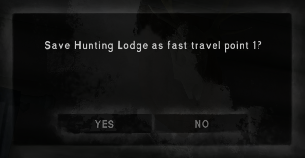
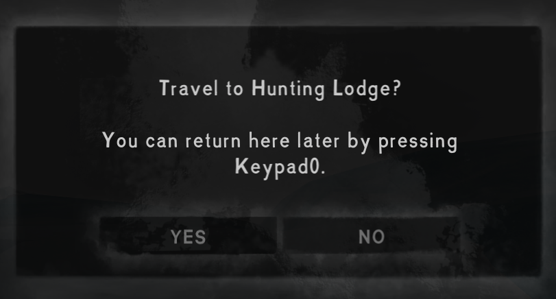

**Fast Travel** is a [The Long Dark] survival mode mod that lets you save up to 9 places (like your
home base), and fast travel to them anytime at the press of a button.

For example, you can have one home base while you explore the world without the tedium of
transferring your hoard to each region.

>  

> [!WARNING]  
> **This mod is still experimental.**  
> I strongly recommend [keeping save backups](../../SaveBackup#readme) when using this mod.

## Contents
* [Install](#install)
* [Use](#use)
* [Configure](#configure)
* [Compatibility](#compatibility)
* [Security](#security)
* [See also](#see-also)

## Install
1. Install [MelonLoader], [ModData][TLDMods], and [ModSettings][TLDMods].
2. [Download this mod][mod page] directly into your game's `Mods` subfolder.
3. Launch the game.

You can [edit the mod settings](#configure) to choose when you can fast travel.

## Use
You can save up to 9 places as a fast travel point. Each one is bound to a specific key (by default
numpad 1 through 9); you can change all the keys in the [mod options](#configure) if needed.

To use fast travel (with the default options):
- Travel to a saved position anytime by pressing its key.
- Save your current position as a fast travel point by pressing `[numpad +]` + destination key.
- Delete a saved fast travel point by pressing `[numpad -]` + destination key.
- Return to where you were before your _most recent_ fast travel by pressing `[numpad 0]`.
- View a list of saved destinations by pressing `[numpad period]`.

The mod always asks for confirmation, so you can't fast travel or change your saved destinations by
mistake.

You can fast travel freely by default. You can change that in the [mod options](#configure).

## Configure
From the game's Options menu, click "Mod Settings" and then navigate to "Fast Travel". Point the
cursor at any field to see an explanation on the right.

> 

## Compatibility
- Compatible with The Long Dark 2.50+ (including 2.55) and MelonLoader 0.7.2+.
- For **survival mode only**. Wintermute's story triggers are very fragile; you shouldn't use fast
  travel in Wintermute even if you get it to work.

Pairs well with [Save Backup](../SaveBackup) in case of any issue.

## Security
This mod is fully open-source. All its source code is public in this repository, so anyone can
verify that it's not doing anything malicious.

Each release also has a [public attestation][GitHub attestations], an unfalsifiable record which
proves exactly how the release file was created. That lets anyone verify that it _only_ contains
this code, and hasn't been modified in any way.

## See also
* [Release notes](release-notes.md)
* [Nexus mod][mod page]

[mod page]: https://www.nexusmods.com/thelongdark/mods/54

[GitHub attestations]: https://docs.github.com/en/actions/concepts/security/artifact-attestations
[MelonLoader]: https://tldmods.net/install.html
[TLDMods]: https://tldmods.net
[The Long Dark]: https://www.thelongdark.com
