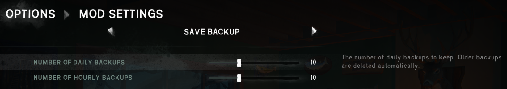

**Save Backup** is a [The Long Dark] mod that automatically backs up all your saves to its subfolder
once per real day.

Particularly when playing with mods, this lets you recover your save if something goes wrong.

## Contents
* [Install](#install)
* [Use](#use)
* [Configure](#configure)
* [Compatibility](#compatibility)
* [Security](#security)
* [See also](#see-also)

## Install
1. Install [MelonLoader] and [ModSettings][TLDMods].
2. [Download this mod][mod page] directly into your game's `Mods` subfolder.
3. Launch the game.

## Use
Just play normally!

By default, the mod will create a backup (a) once per real day and (b) once per real hour. It'll
keep the last 10 backups of each type. If you receive a MelonLoader or game update, it'll create a
new backup just in case.

This all happens in the background, so it doesn't affect the game's startup time.

To restore a backup, just copy the files from the zip back into your saves folder at
`%localappdata%\Hinterland\TheLongDark`. (You can paste that exact path into Windows Explorer.)

## Configure
From the game's Options menu, click "Mod Settings" and then navigate to "Save Backup". Point the
cursor at any field to see an explanation on the right.

> 

## Compatibility
- Compatible with The Long Dark 2.50+ (including 2.54) and MelonLoader 0.7.2+.
- Works with both survival mode and Wintermute.

## Security
This mod is fully open-source. All its source code is public in this repository, so anyone can
verify that it's not doing anything malicious.

Each release also has a [public attestation][GitHub attestations], an unfalsifiable record which
proves exactly how the release file was created. That lets anyone verify that it _only_ contains
this code, and hasn't been modified in any way.

## See also
* [Release notes](release-notes.md)
* [Nexus mod][mod page]

[mod page]: https://www.nexusmods.com/thelongdark/mods/53

[GitHub attestations]: https://docs.github.com/en/actions/concepts/security/artifact-attestations
[MelonLoader]: https://tldmods.net/install.html
[TLDMods]: https://tldmods.net
[The Long Dark]: https://www.thelongdark.com
