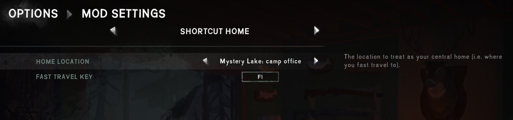

**Shortcut Home** is a [The Long Dark] survival mode mod that lets you fast travel between a
safehouse and your main home. This lets you explore the world without the tedium of transferring
your hoard to another base in each region.

> [!NOTE]  
> **This is an early proof-of-concept mod.**  
> Use at your own risk. The mod is currently unbalanced, lacks safeguards, and can only set
> specific predefined locations as your home base. This will be improved before release.
>
> TO DO BEFORE RELEASE:
> - Add custom decor items: one as the 'anchor' in your home location, and one in other decoratable
>   safehouses to act as the other end of the fast travel connection. Maybe based on the small
>   painting of a house?
> - Add confirmation dialogue before fast traveling.

## Contents
* [Install](#install)
* [Use](#use)
* [Configure](#configure)
* [Compatibility](#compatibility)
* [See also](#see-also)

## Install
1. Install [MelonLoader], [ModData][TLDMods], and [ModSettings][TLDMods].
2. Download this mod's DLL directly into your game's `Mods` subfolder.
3. Launch the game.

## Use
[Configure the mod](#configure) to set your home base, then press `F1` (configurable) to fast
travel back home. While inside your home, press it again to fast travel back to where you were.

> [!WARNING]  
> Pressing `F1` while anywhere other than your home base will set that location as the new fast
> travel destination. Be careful not to warp home, go outside, then press `F1` expecting to return
> to your original location!

## Configure
From the game's Options menu, click "Mod Settings" and then navigate to "Shortcut Home".
Hover the cursor over a field for details.

> 

## Compatibility
The mod is compatible with The Long Dark 2.50+ and MelonLoader 0.7.2+.

## See also
* [Release notes](release-notes.md)
* ~~Nexus mod~~ (not released yet)

[MelonLoader]: https://tldmods.net/install.html
[TLDMods]: https://tldmods.net
[The Long Dark]: https://www.thelongdark.com
