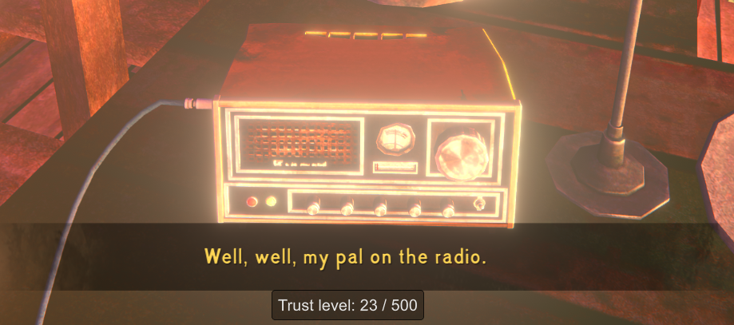

**Show Trader Trust** is a [The Long Dark] survival mode mod that shows your current [trust level][]
with the [trader][] when talking with him on the radio.

> 

## Contents
* [Install](#install)
* [Use](#use)
* [Configure](#configure)
* [Compatibility](#compatibility)
* [Security](#security)
* [See also](#see-also)

## Install
1. Install [MelonLoader].
2. [Download this mod][mod page] directly into your game's `Mods` subfolder.
3. Launch the game.

## Use
Just call the [trader] like usual. While you're on the radio with him, your trust level will be
shown near the bottom of the screen.

## Compatibility
- Compatible with The Long Dark 2.50+ (including 2.55) and MelonLoader 0.7.2+.
- For survival mode only. (There's no trader mechanic in Wintermute.)

## Security
This mod is fully open-source. All its source code is public in this repository, so anyone can
verify that it's not doing anything malicious.

Each release also has a [public attestation][GitHub attestations], an unfalsifiable record which
proves exactly how the release file was created. That lets anyone verify that it _only_ contains
this code, and hasn't been modified in any way.

## See also
* [Release notes](release-notes.md)
* [Nexus mod][mod page]

[mod page]: https://www.nexusmods.com/thelongdark/mods/58

[GitHub attestations]: https://docs.github.com/en/actions/concepts/security/artifact-attestations
[MelonLoader]: https://tldmods.net/install.html
[The Long Dark]: https://www.thelongdark.com

[trust level]: https://thelongdark.fandom.com/wiki/Trader#Trust
[trader]: https://thelongdark.fandom.com/wiki/Trader
